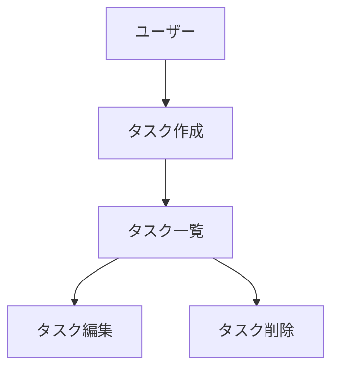

# CLAUDE.md (プロジェクトメモリ)

## 概要
開発を進めるうえで遵守すべき標準ルールを定義します。

## プロジェクト構造

### ドキュメントの分類

#### 1. 永続的ドキュメント（`docs/superpowers/specs/`）

アプリケーション全体の「**何を作るか**」「**どう作るか**」を定義する恒久的なドキュメント。
`superpowers:brainstorming` スキルで生成し、`docs/superpowers/specs/YYYY-MM-DD-<topic>-design.md` に保存します。
アプリケーションの基本設計や方針が変わらない限り更新されません。

現在の設計ドキュメント：
- `docs/superpowers/specs/2026-06-29-rss-feed-translator-design.md` - システム設計書
  - プロダクトビジョンと目的
  - アーキテクチャ設計
  - データモデル定義
  - コンポーネント設計
  - 技術仕様（テクノロジースタック、開発ツール）
  - 機能要件・非機能要件
  - 開発ガイドライン・命名規則

#### 2. 作業単位のドキュメント（`docs/superpowers/plans/`）

特定の開発作業における「**今回何をするか**」を定義する実装計画。
`superpowers:writing-plans` スキルで生成し、`docs/superpowers/plans/YYYY-MM-DD-<feature>.md` に保存します。
作業完了後は履歴として保持されます。

現在の実装計画：
- `docs/superpowers/plans/2026-06-29-rss-feed-translator.md` - 初回実装計画

#### 3. 進捗管理（`.superpowers/sdd/progress.md`）

`superpowers:subagent-driven-development` スキルによるタスク進捗を記録します。
コンテキストがリセットされた場合の復旧マップとして機能します。

### ステアリングディレクトリの命名規則

superpowers スキル使用時のファイル命名：

```
docs/superpowers/specs/YYYY-MM-DD-<topic>-design.md   # 設計ドキュメント
docs/superpowers/plans/YYYY-MM-DD-<feature>.md         # 実装計画
```

## 開発プロセス

superpowers スキルを使って開発を進めます。

### 初回セットアップ時の手順

1. **設計** — `superpowers:brainstorming` スキルで設計し、`docs/superpowers/specs/` に保存
2. **実装計画** — `superpowers:writing-plans` スキルで計画を作成し、`docs/superpowers/plans/` に保存
3. **環境セットアップ** — `uv sync --all-extras`
4. **実装** — `superpowers:subagent-driven-development` スキルでタスクを順に実装
5. **品質チェック** — `uv run pytest`, `uv run ruff check`, `uv run mypy src/`

### 機能追加・修正時の手順

1. **影響分析** — `docs/superpowers/specs/` の設計ドキュメントへの影響を確認
2. **設計更新** — 基本設計に影響する場合は `superpowers:brainstorming` で設計を更新
3. **実装計画** — `superpowers:writing-plans` で新しい計画ファイルを作成
4. **実装** — `superpowers:subagent-driven-development` で実装
5. **品質チェック**

## ドキュメント管理の原則

### 永続的ドキュメント（`docs/superpowers/specs/`）
- `superpowers:brainstorming` スキルで生成
- アプリケーションの基本設計を記述
- 大きな設計変更時のみ更新
- プロジェクト全体の「北極星」として機能

### 実装計画（`docs/superpowers/plans/`）
- `superpowers:writing-plans` スキルで生成
- 作業ごとに新しいファイルを作成
- 作業完了後は履歴として保持
- 変更の意図と経緯を記録

### 進捗管理（`.superpowers/sdd/progress.md`）
- `superpowers:subagent-driven-development` スキルが自動更新
- コンテキストリセット後の復旧マップとして機能

## 図表・ダイアグラムの記載ルール

### 記載場所
設計図やダイアグラムは、関連する永続的ドキュメント内に直接記載します。
独立したdiagramsフォルダは作成せず、手間を最小限に抑えます。

**配置例：**
- ER図、データモデル図 → `functional-design.md` 内に記載
- ユースケース図 → `functional-design.md` または `product-requirements.md` 内に記載
- 画面遷移図、ワイヤフレーム → `functional-design.md` 内に記載
- システム構成図 → `functional-design.md` または `architecture.md` 内に記載

### 記述形式
1. **Mermaid記法（推奨）**
   - Markdownに直接埋め込める
   - バージョン管理が容易
   - ツール不要で編集可能



2. **ASCII アート**
   - シンプルな図表に使用
   - テキストエディタで編集可能

```
┌─────────────┐
│   Header    │
└─────────────┘
       │
       ↓
┌─────────────┐
│  Task List  │
└─────────────┘
```

3. **画像ファイル（必要な場合のみ）**
   - 複雑なワイヤフレームやモックアップ
   - `docs/images/` フォルダに配置
   - PNG または SVG 形式を推奨

### 図表の更新
- 設計変更時は対応する図表も同時に更新
- 図表とコードの乖離を防ぐ

## 注意事項

- ドキュメントの作成・更新は段階的に行い、各段階で承認を得る
- 永続的ドキュメントと実装計画を混同しない
- コード変更後は必ずリント・型チェックを実施する（`uv run ruff check`, `uv run mypy src/`）
- セキュリティを考慮したコーディング（入力バリデーション、APIキーの環境変数管理など）
- 図表は必要最小限に留め、メンテナンスコストを抑える
