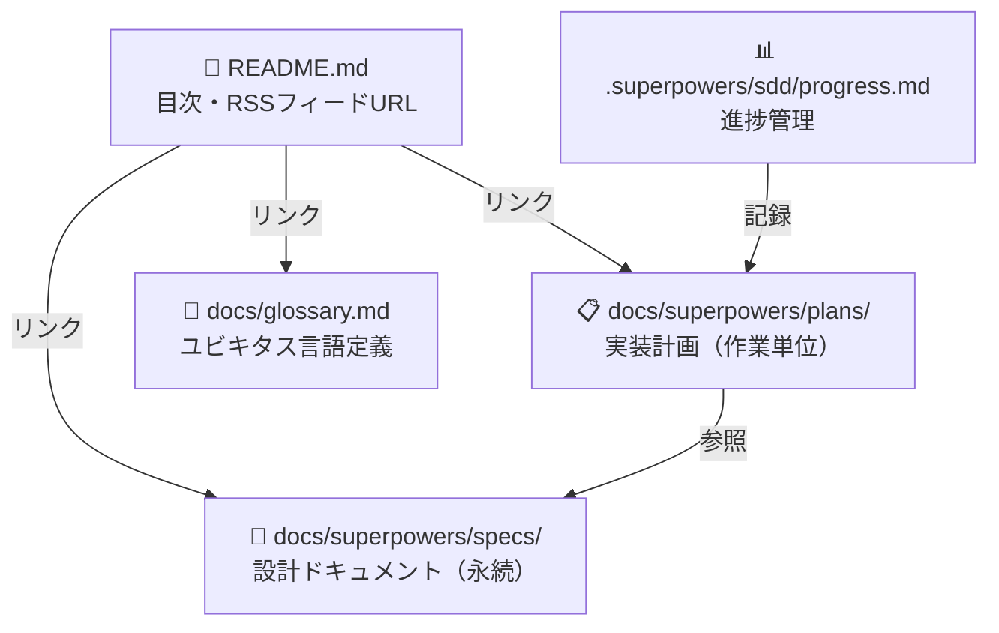
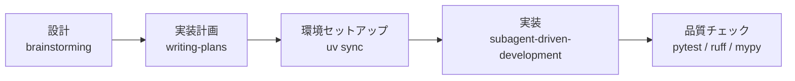
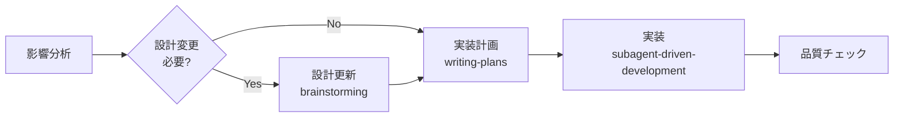

# CLAUDE.md (プロジェクトメモリ)

## 概要

開発を進めるうえで遵守すべき標準ルールを定義します。

---

## ドキュメント構成

各ドキュメントの役割と関係を示します。



### 1. 設計ドキュメント（`docs/superpowers/specs/`）

`superpowers:brainstorming` スキルで生成。基本設計や方針が変わらない限り更新しません。

**設計ドキュメント完了チェックリスト（保存前に必ず確認）：**

- [ ] システム全体構成図（外部サービス・コンポーネントの関係）を Mermaid で記載した
- [ ] パイプライン・データフロー図を Mermaid で記載した
- [ ] 主要なクラス・インターフェースの関係を classDiagram で記載した
- [ ] 複雑なシーケンス（HTTP通信・非同期処理など）を sequenceDiagram で記載した

含めるべき項目：
- プロダクトビジョン・ターゲットユーザー・課題
- 機能要件・非機能要件・ユーザーストーリー・受け入れ条件
- アーキテクチャ・システム構成図・データモデル（ER図含む）
- コンポーネント設計・技術仕様・パフォーマンス要件
- コーディング規約・命名規則・テスト規約・Git規約
- フォルダ・ファイル構成・ディレクトリの役割
- セットアップ手順・設定方法・開発コマンド

現在のファイル：
- `docs/superpowers/specs/2026-06-29-rss-feed-translator-design.md`

### 2. 実装計画（`docs/superpowers/plans/`）

`superpowers:writing-plans` スキルで生成。作業完了後も履歴として保持します。

含めるべき項目：
- 変更・追加する機能の説明
- 実装アプローチ・変更コンポーネント・影響範囲
- 具体的な実装タスクと完了条件

現在のファイル：
- `docs/superpowers/plans/2026-06-29-rss-feed-translator.md`

### 3. 進捗管理（`.superpowers/sdd/progress.md`）

`superpowers:subagent-driven-development` スキルが自動更新。コンテキストリセット後の復旧マップとして機能します。

### 4. ユビキタス言語定義（`docs/glossary.md`）

ドメイン用語・英日対応表・コード上の命名規則を定義します。設計ドキュメントとは独立して参照できるよう単独ファイルで管理します。

### 5. README（`README.md`）

リポジトリの目次として機能します。詳細は設計ドキュメントへのリンクで参照する構成にします。

含めるべき内容：
- プロジェクトの一行説明
- RSSフィードURL
- ドキュメントへのリンク（設計・実装計画・用語定義）

---

## ファイル命名規則

```
docs/superpowers/specs/YYYY-MM-DD-<topic>-design.md   # 設計ドキュメント
docs/superpowers/plans/YYYY-MM-DD-<feature>.md         # 実装計画
```

---

## 開発プロセス

### 初回セットアップ



1. **設計** — `superpowers:brainstorming` で設計し `docs/superpowers/specs/` に保存
2. **実装計画** — `superpowers:writing-plans` で計画を作成し `docs/superpowers/plans/` に保存
3. **環境セットアップ** — `uv sync --all-extras`
4. **実装** — `superpowers:subagent-driven-development` でタスクを順に実装
5. **品質チェック** — `uv run pytest`, `uv run ruff check src/ tests/`, `uv run mypy src/`

### 機能追加・修正



1. **影響分析** — `docs/superpowers/specs/` の設計ドキュメントへの影響を確認
2. **設計更新** — 基本設計に影響する場合は `superpowers:brainstorming` で更新
3. **実装計画** — `superpowers:writing-plans` で新しい計画ファイルを作成
4. **実装** — `superpowers:subagent-driven-development` で実装
5. **品質チェック**

---

## 図表・ダイアグラムの記載ルール

設計図は関連する設計ドキュメント内に直接記載します。独立した `diagrams/` フォルダは作成しません。

記述形式（優先順）：
1. **Mermaid記法** — Markdownに直接埋め込め、バージョン管理が容易（推奨）
2. **ASCII アート** — シンプルな図表に使用
3. **画像ファイル** — 複雑なモックアップのみ。`docs/images/` に PNG または SVG で配置

設計変更時は対応する図表も同時に更新し、コードとの乖離を防ぎます。

---

## 注意事項

- ドキュメントの作成・更新は段階的に行い、各段階で承認を得る
- コード変更後は必ずリント・型チェックを実施する
- セキュリティを考慮したコーディング（入力バリデーション、APIキーの環境変数管理）
- 図表は必要最小限に留め、メンテナンスコストを抑える
