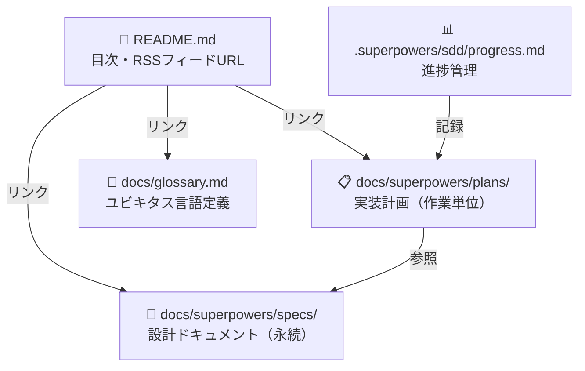
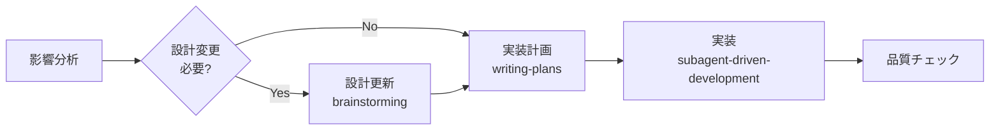

# CLAUDE.md (プロジェクトメモリ)

## 概要

開発を進めるうえで遵守すべき標準ルールを定義します。

---

## ドキュメント構成

各ドキュメントの役割と関係を示します。



### 1. 設計ドキュメント（`docs/superpowers/specs/`）

`superpowers:brainstorming` スキルで生成。基本設計や方針が変わらない限り更新しません。

保存前に「ドキュメント完了チェックリスト」セクションの設計ドキュメント項目を確認してください。

含めるべき項目：
- プロダクトビジョン・ターゲットユーザー・課題・ニーズ
- 主要な機能一覧
- 成功の定義
- ビジネス要件
- ユーザーストーリー・受け入れ条件
- 機能要件・非機能要件
- アーキテクチャ・システム構成図・データモデル（ER図含む）
- コンポーネント設計
- ユースケース図・画面遷移図・ワイヤフレーム（該当する場合）
- API設計（バックエンドと連携する場合）
- テクノロジースタック（言語・フレームワーク・外部サービス）
- 開発ツールと手法（リンター・フォーマッター・テストフレームワーク・CI/CDツール）
- 技術的制約と要件（動作環境・バージョン要件・インフラ制約）
- パフォーマンス要件
- フォルダ・ファイル構成・ディレクトリの役割・ファイル配置ルール
- コーディング規約・命名規則・スタイリング規約・テスト規約・Git規約
- セットアップ手順・設定方法・開発コマンド

### 2. 実装計画（`docs/superpowers/plans/`）

`superpowers:writing-plans` スキルで生成。作業完了後も履歴として保持します。

含めるべき項目：
- 変更・追加する機能の説明
- 実装アプローチ・変更コンポーネント・影響範囲
- 具体的な実装タスクと完了条件

### 3. 進捗管理（`.superpowers/sdd/progress.md`）

`superpowers:subagent-driven-development` スキルが自動更新。コンテキストリセット後の復旧マップとして機能します。

### 4. ユビキタス言語定義（`docs/glossary.md`）

ドメイン用語・英日対応表・コード上の命名規則を定義します。設計ドキュメントとは独立して参照できるよう単独ファイルで管理します。

### 5. README（`README.md`）

リポジトリの顔として機能します。FastAPI スタイル（中央揃えロゴ → バッジ → リンク → 概要 → 特長）を採用しています。

含めるべき内容：
- **SVG ロゴ** — `docs/images/logo.svg`（中央揃え）
- **キャッチコピー** — イタリック・中央揃えの一行説明
- **バッジ** — CI ステータス（Update RSS・Test）・Python バージョン・Review Report リンク
- **重要リンク** — 各フィードの RSS URL・翻訳要約レビューレポート（`docs/report.html`）
- **アプリケーション概要・特長** — 箇条書きで主要機能を説明
- **ドキュメントへのリンク** — 設計・実装計画・用語定義

バッジ追加の指針：
- CI/CD ステータスは GitHub Actions バッジを使用する
- 技術スタック（Python バージョン等）は shields.io バッジを使用する
- `logo=` パラメータでアイコンを付与してビジュアルを強化する

SVG ロゴの注意事項：
- `docs/images/logo.svg` に配置する
- GitHub の Markdown レンダラーは SVG 内の CSS `@media (prefers-color-scheme: dark)` を無効化するため、ダークモード対応には `<picture>` タグを使う必要がある（現状はライトモード固定）

---

## ファイル命名規則

```
docs/superpowers/specs/YYYY-MM-DD-<topic>-design.md   # 設計ドキュメント
docs/superpowers/plans/YYYY-MM-DD-<feature>.md         # 実装計画
```

---

## 開発プロセス

### 初回セットアップ


1. **設計** — `superpowers:brainstorming` で設計し `docs/superpowers/specs/` に保存
2. **実装計画** — `superpowers:writing-plans` で計画を作成し `docs/superpowers/plans/` に保存
3. **環境セットアップ** — `uv sync --all-extras`
4. **実装** — `superpowers:subagent-driven-development` でタスクを順に実装
5. **品質チェック** — `uv run pytest`, `uv run ruff check src/ tests/`, `uv run mypy src/`
6. **ドキュメントレビュー** — 下記チェックリストで漏れを確認

### 機能追加・修正



1. **影響分析** — `docs/superpowers/specs/` の設計ドキュメントへの影響を確認
2. **設計更新** — 基本設計に影響する場合は `superpowers:brainstorming` で更新
3. **実装計画** — `superpowers:writing-plans` で新しい計画ファイルを作成
4. **実装** — `superpowers:subagent-driven-development` で実装
5. **品質チェック**
6. **ドキュメント更新** — コード変更と**同じコミット**で設計ドキュメント・用語定義・READMEを更新する。後回し禁止。

---

## ドキュメント記載ルール

### 目次・セクション構造

セクション数が10を超える場合は、ドキュメント先頭に目次を追加する。複数ファイルへの分割はしない（サブエージェントへの受け渡しが複雑になるため）。

目次のセクションが多い場合は、関連するセクションを**太字のグループ見出し**でまとめて可読性を高める。本文にも対応する `##` グループセクションを設け、既存セクションを一段下げて `###`、その配下を `####` とする。

```
## アーキテクチャ・設計     ← グループ（##）
### アーキテクチャ           ← 従来の ## を降格
#### システム全体構成        ← 従来の ### を降格

## コンポーネント
### RSS取得（src/fetcher.py）
```

### 図表・ダイアグラム

設計図は関連する設計ドキュメント内に直接記載します。独立した `diagrams/` フォルダは作成しません。図表は必要最小限に留め、メンテナンスコストを抑えます。

記述形式（優先順）：
1. **Mermaid記法** — Markdownに直接埋め込め、バージョン管理が容易（推奨）
2. **ASCII アート** — シンプルな図表に使用
3. **画像ファイル** — 複雑なモックアップのみ。`docs/images/` に PNG または SVG で配置

設計変更時は対応する図表も同時に更新し、コードとの乖離を防ぎます。

---

## ドキュメント完了チェックリスト

実装完了後・コミット前に、以下のすべての項目を確認します。
**「はい」でない項目があれば、コミット前に追記・修正してください。**

### 設計ドキュメント（`docs/superpowers/specs/`）

**構造：**
- [ ] セクション数が10を超える場合、ドキュメント先頭に目次を追加した
- [ ] （目次がある場合）セクションが多い場合、太字のグループ見出しでまとめた
- [ ] （目次がある場合）本文に対応する `##` グループセクションを設け、既存セクションを `###` に降格した

**プロダクト要件：**
- [ ] プロダクトビジョン・ターゲットユーザー・課題・ニーズが記載されている
- [ ] 主要な機能一覧が記載されている
- [ ] 成功の定義が記載されている
- [ ] ビジネス要件が記載されている
- [ ] ユーザーストーリー・受け入れ条件が記載されている
- [ ] 機能要件・非機能要件が記載されている

**機能設計：**
- [ ] システムアーキテクチャ（コンポーネント構成）が記載されている
- [ ] データモデル（主要なクラス・データ構造）が記載されている
- [ ] コンポーネント設計が記載されている
- [ ] ユースケース図・画面遷移図・ワイヤフレームが記載されている（該当する場合）
- [ ] API設計が記載されている（バックエンドと連携する場合）
- [ ] エラーハンドリング方針（リトライ・例外の種類と意図）が記載されている

**技術仕様：**
- [ ] テクノロジースタック（言語・フレームワーク・外部サービス）が記載されている
- [ ] 開発ツールと手法が記載されている
- [ ] 技術的制約と要件（動作環境・バージョン要件・インフラ制約）が記載されている
- [ ] パフォーマンス要件が記載されている

**リポジトリ構造：**
- [ ] フォルダ・ファイル構成とディレクトリの役割が記載されている
- [ ] ファイル配置ルールが記載されている

**開発ガイドライン：**
- [ ] コーディング規約が記載されている
- [ ] 命名規則が記載されている（または `docs/glossary.md` への参照がある）
- [ ] スタイリング規約が記載されている
- [ ] テスト規約が記載されている
- [ ] Git規約（コミットメッセージ規則など）が記載されている
- [ ] セットアップ手順・設定方法・開発コマンドが記載されている
- [ ] CI/CDワークフロー（トリガー・ステップ・デプロイ先）が記載されている

**図表の網羅性：**
- [ ] システム全体構成図（外部サービス・コンポーネントの関係）を Mermaid で記載した
- [ ] パイプライン・データフロー図を Mermaid で記載した
- [ ] 主要なクラス・インターフェースの関係を classDiagram で記載した
- [ ] 複雑なシーケンス（HTTP通信・非同期処理など）を sequenceDiagram で記載した

### 用語定義（`docs/glossary.md`）

- [ ] ドメイン用語・ビジネス用語が定義されている
- [ ] UI/UX用語が定義されている（該当する場合）
- [ ] 英語・日本語対応表が記載されている
- [ ] コード上の命名規則が記載されている
- [ ] 新しいコンポーネント・関数・変数名のパターンが命名規則に反映されている

### README（`README.md`）

- [ ] `docs/images/logo.svg` が存在し、中央揃えで表示されている
- [ ] CI/CD バッジ（Update RSS・Test）が最新のワークフロー名と一致している
- [ ] フィードURLが全フィード（Ars Technica・Hacker News・DEV Community・InfoQ）を含んでいる
- [ ] 翻訳要約レビューレポートへのリンクが有効である
- [ ] 設計ドキュメント・実装計画・用語定義へのリンクが有効である

### 実装計画（`docs/superpowers/plans/`）

- [ ] すべてのタスクに完了状態（完了済みかどうか）が記録されている
