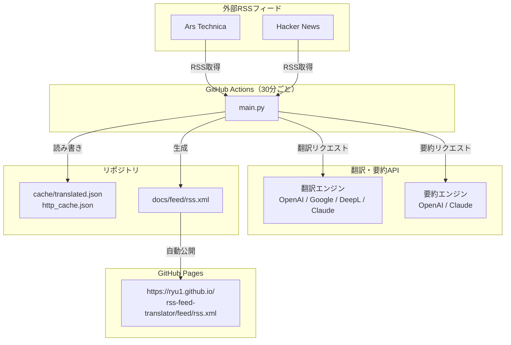
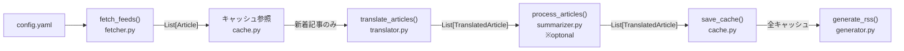
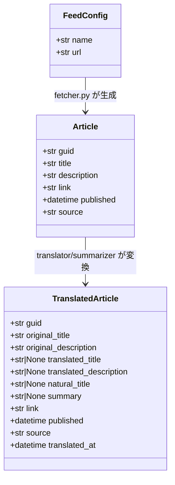
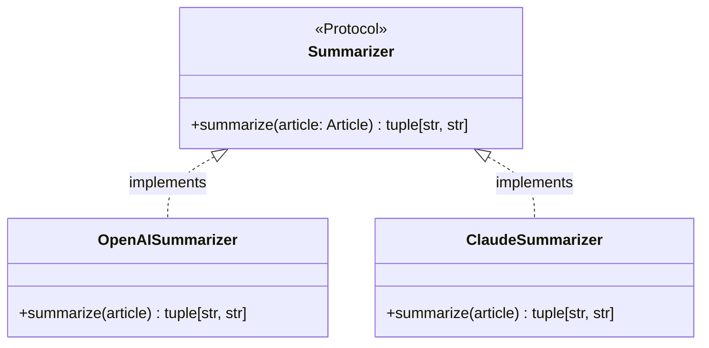
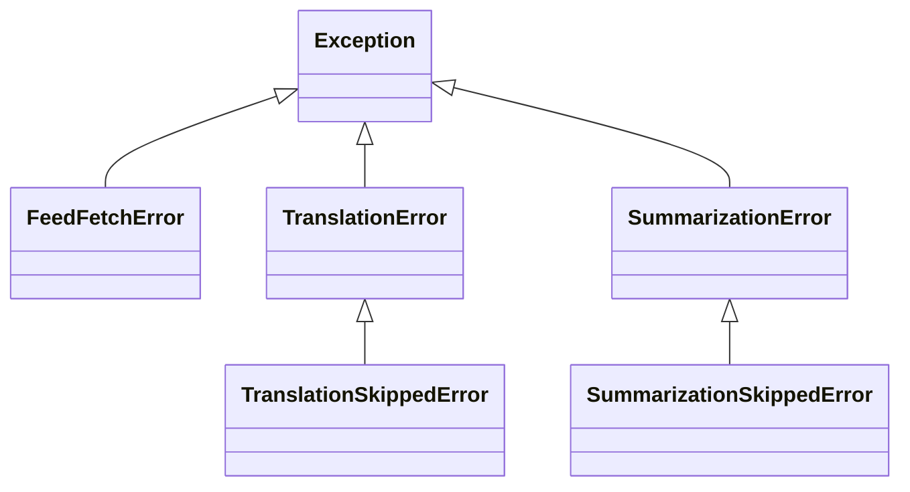
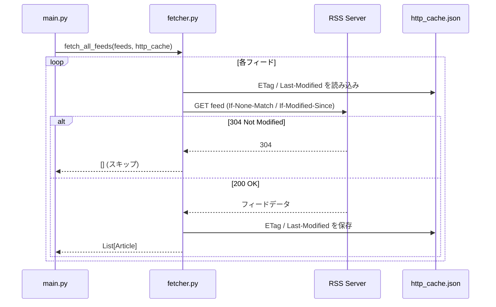
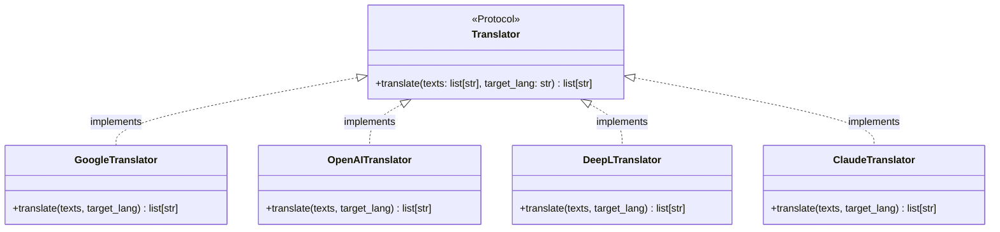

# RSS Feed Translator — 設計ドキュメント

作成日: 2026-06-29

---

## 概要

海外RSSフィードを定期的に取得し、記事タイトルおよび概要を日本語に翻訳した新しいRSSフィードを生成・公開するシステム。GitHub Actions + GitHub Pagesで完全サーバーレスに運用する。

---

## アーキテクチャ

### システム全体構成



### パイプライン（データフロー）

単一の`main.py`エントリポイントから5つのモジュールをシーケンシャルに呼び出す。



**翻訳とLLM処理の2段階設計:**

- **翻訳**（`Translator`）: タイトル・概要の機械翻訳。高速・低コスト
- **LLM処理**（`Summarizer`）: 自然な日本語タイトル + 3行要約。翻訳後にオプションで実行

`config.yaml`の`summarizer.enabled`で切り替え可能。

---

## リポジトリ構造

```
rss-feed-translator/
├── config.yaml                      # フィード・翻訳エンジン設定
├── main.py                          # エントリポイント
├── src/
│   ├── fetcher.py                   # RSS取得（ETag/Last-Modified対応）
│   ├── translator.py                # Translatorプロトコル定義 + エンジン選択
│   ├── translators/
│   │   ├── google.py                # Google Translate実装
│   │   ├── openai.py                # OpenAI翻訳実装
│   │   └── deepl.py                 # DeepL実装
│   ├── summarizer.py                # Summarizerプロトコル定義 + エンジン選択
│   ├── summarizers/
│   │   ├── openai.py                # OpenAI（GPT-4o等）実装
│   │   └── claude.py                # Claude実装
│   ├── generator.py                 # RSS XML生成
│   ├── cache.py                     # 翻訳キャッシュ管理
│   ├── models.py                    # データクラス定義
│   └── exceptions.py                # カスタム例外クラス
├── tests/
│   ├── conftest.py                  # pytest共通フィクスチャ
│   ├── test_fetcher.py
│   ├── test_translator.py
│   ├── test_summarizer.py
│   ├── test_cache.py
│   └── test_generator.py
├── cache/
│   ├── translated.json              # 翻訳済み記事キャッシュ（gitコミット対象）
│   └── http_cache.json              # ETag/Last-Modifiedキャッシュ（gitコミット対象）
├── docs/
│   └── rss.xml                      # 生成済みRSS（GitHub Pages公開）
├── .github/
│   └── workflows/
│       ├── update-rss.yml           # 30分cron + workflow_dispatch
│       └── test.yml                 # プッシュ時のテスト実行
├── pyproject.toml                   # 依存関係・リンター設定
└── uv.lock                          # 依存関係ロックファイル
```

---

## 設定ファイル（config.yaml）

```yaml
feeds:
  - name: Ars Technica
    url: https://feeds.arstechnica.com/arstechnica/index
  - name: Hacker News
    url: https://hnrss.org/frontpage

translator:
  engine: google   # google | openai | deepl

summarizer:
  enabled: true                  # falseにすると翻訳のみ
  engine: openai                 # openai | claude
  model: gpt-4o-mini             # 使用モデル（コスト最適化）
  prompt: |
    以下の英語のITニュース記事のタイトルと概要を読み、
    1. 自然な日本語タイトル（直訳でなく読みやすく）
    2. 3行程度の日本語要約
    を生成してください。

output:
  path: docs/rss.xml
  max_items: 200   # RSSに含める最大記事数

cache:
  path: cache/translated.json
  http_cache_path: cache/http_cache.json
```

APIキーはGitHub Secretsから環境変数として注入する。設定ファイルにはハードコードしない。

---

## データモデル（src/models.py）

全クラスに型ヒントを付与する。`dataclass`を使用してイミュータブルなデータ構造を定義する。



```python
from dataclasses import dataclass
from datetime import datetime

@dataclass(frozen=True)
class FeedConfig:
    name: str
    url: str

@dataclass(frozen=True)
class Article:
    guid: str
    title: str
    description: str
    link: str
    published: datetime
    source: str

@dataclass
class TranslatedArticle:
    guid: str
    original_title: str
    original_description: str
    translated_title: str | None        # 翻訳失敗時はNone
    translated_description: str | None
    natural_title: str | None           # LLM生成の自然な日本語タイトル（summarizer無効時はNone）
    summary: str | None                 # LLM生成の3行要約（summarizer無効時はNone）
    link: str
    published: datetime
    source: str
    translated_at: datetime
```

RSS生成時は`natural_title`が存在すれば優先して使用し、なければ`translated_title`にフォールバックする。`summary`が存在すれば`<description>`に使用する。

## LLM要約処理（src/summarizer.py / src/summarizers/）



### Protocolインターフェース

```python
from typing import Protocol
from src.models import Article

class Summarizer(Protocol):
    def summarize(self, article: Article) -> tuple[str, str]:
        """(natural_title, summary) を返す"""
        ...
```

翻訳エンジンと同様にProtocolで抽象化。`config.yaml`の`summarizer.enabled: false`で無効化でき、翻訳のみの構成にも対応する。

### エンジン

- **OpenAI**（`gpt-4o-mini`推奨）: コスト低、応答速度良好
- **Claude**（`claude-haiku-4-5-20251001`推奨）: 日本語品質が高い

### プロンプト設計

記事の`title`・`description`・`source`を入力とし、構造化された出力（JSONモード）を使って`natural_title`と`summary`を確実に取得する。

期待するJSON出力フォーマット:
```json
{
  "natural_title": "自然な日本語タイトル",
  "summary": "1行目の要約。\n2行目の要約。\n3行目の要約。"
}
```

### コスト考慮

`summarizer`はLLM呼び出しのためコストが発生する。キャッシュに`natural_title`と`summary`を保存し、再処理を防ぐ。設定で`enabled: false`にすれば翻訳APIのみで動作する低コスト構成にいつでも戻せる。

---

## カスタム例外（src/exceptions.py）

エラー種別を明示的に分類し、呼び出し元でのハンドリングを容易にする。



```python
class FeedFetchError(Exception):
    """RSSフィードの取得に失敗した場合"""

class TranslationError(Exception):
    """翻訳APIの呼び出しに失敗した場合"""

class TranslationSkippedError(TranslationError):
    """リトライ上限に達して翻訳をスキップした場合"""

class SummarizationError(Exception):
    """LLM要約の生成に失敗した場合"""

class SummarizationSkippedError(SummarizationError):
    """リトライ上限に達して要約をスキップした場合"""
```

---

## RSS取得（src/fetcher.py）



- `feedparser`でRSS 2.0およびAtomを解析
- `requests`でHTTPリクエスト。ETag / Last-Modifiedをリクエストヘッダに付与し、304 Not Modifiedを活用
- フィードごとに独立してtry/catchし、取得失敗しても他フィードの処理を継続
- 新着記事の判定はキャッシュのGUID一覧との差分で行う

---

## 翻訳エンジン（src/translator.py / src/translators/）



### Protocolインターフェース

```python
from typing import Protocol

class Translator(Protocol):
    def translate(self, texts: list[str], target_lang: str = "ja") -> list[str]:
        ...
```

構造的サブタイピングにより継承不要。`translate()`メソッドを持つクラスであれば自動的に適合する。

### エンジン優先順位

1. Google Translate（`google-cloud-translate`）
2. OpenAI（`openai`）
3. DeepL（`deepl`）

`config.yaml`の`translator.engine`で切り替え。APIキーは環境変数から取得。

### 翻訳対象

- `title`（記事タイトル）
- `description`（記事概要）
- 本文（full text）は対象外

### バッチ翻訳

1記事ずつではなく、新着記事のtitle・descriptionをまとめてAPIに送信しAPI呼び出し回数を最小化する。

---

## キャッシュ（src/cache.py）

### translated.json

GUIDをキーとしたJSONオブジェクト。差分更新はGUIDの存在確認のみでO(1)。

```json
{
  "https://example.com/article-1": {
    "original_title": "AI Breakthrough",
    "original_description": "Researchers found...",
    "translated_title": "AI分野の突破口",
    "translated_description": "研究者たちは...",
    "natural_title": "AI研究に新たな突破口、業界に波紋",
    "summary": "研究者チームが新たなAIアーキテクチャを発表した。\n従来手法の10倍の効率を達成し、エネルギー消費も大幅に削減。\n商用化に向けた実証実験が2026年内に開始される予定。",
    "source": "Ars Technica",
    "published": "2026-06-29T10:00:00Z",
    "link": "https://example.com/article-1",
    "translated_at": "2026-06-29T10:05:00Z"
  }
}
```

`natural_title`・`summary`はsummarizer無効時は`null`として保存される。

翻訳失敗でスキップされた記事も`translated_title: null`でキャッシュに保存し、無限リトライを防止する。再翻訳が必要な場合はキャッシュエントリを手動削除する。

### http_cache.json

フィードURLをキーとして`ETag`と`Last-Modified`を保存。

```json
{
  "https://feeds.arstechnica.com/arstechnica/index": {
    "etag": "\"abc123\"",
    "last_modified": "Mon, 29 Jun 2026 10:00:00 GMT"
  }
}
```

---

## RSS生成（src/generator.py）

- `defusedxml`を使いXXE/Billion Laughs攻撃を防ぐ。生成には`xml.etree.ElementTree`、解析には`defusedxml.ElementTree`を使用
- `cache/translated.json`の全件を`pubDate`降順でソートして出力
- 出力先: `docs/rss.xml`（GitHub Pagesのソースディレクトリ）

### itemの構成

```xml
<item>
  <title>AI分野の突破口</title>
  <description>研究者たちは...</description>
  <link>https://example.com/article-1</link>
  <pubDate>Mon, 29 Jun 2026 10:00:00 +0000</pubDate>
  <source>Ars Technica</source>
  <guid isPermaLink="false">https://example.com/article-1</guid>
  <original:title>AI Breakthrough</original:title>
</item>
```

GUIDは元記事のGUIDをそのまま保持する。

---

## エラー処理

| 状況 | 動作 |
|---|---|
| RSS取得失敗 | `WARNING`ログを出力して次のフィードへ継続 |
| 翻訳API失敗 | 指数バックオフで最大3回リトライ（1秒→2秒→4秒） |
| 3回失敗した記事（翻訳） | `ERROR`ログを出力してスキップ。`translated_title: null`でキャッシュ保存 |
| LLM要約API失敗 | 指数バックオフで最大3回リトライ |
| 3回失敗した記事（要約） | `ERROR`ログを出力してスキップ。`natural_title: null`でキャッシュ保存。翻訳結果はそのまま使用 |
| GitHub Actions全体 | スキップがあっても`exit 0`で正常終了 |

各フィード・各記事単位で例外をキャッチし、システム全体が停止しない設計とする。

---

## ログ

Pythonの標準`logging`モジュールを使用。`StreamHandler`でGitHub Actionsのコンソールに出力。

```
[INFO]  Starting RSS feed translator
[INFO]  Fetching 5 feeds...
[INFO]  Feed: Ars Technica — 10 articles fetched (3 new)
[ERROR] Feed: Hacker News — fetch failed: Connection timeout (skipped)
[INFO]  Translating 12 articles (8 cache hits, 4 new)...
[INFO]  Translated: 4 articles (2 retried, 0 skipped)
[INFO]  Summarizing 4 articles with LLM (summarizer=openai/gpt-4o-mini)...
[INFO]  Summarized: 4 articles (0 skipped)
[INFO]  RSS generated: docs/rss.xml (112 articles total)
[INFO]  Done in 31.2s | fetched=20 new=12 translated=4 summarized=4 errors=1
```

最終行のサマリー行でGitHub Actionsのログから一目で状況を把握できる。

---

## GitHub Actionsワークフロー（.github/workflows/update-rss.yml）

```yaml
on:
  schedule:
    - cron: '*/30 * * * *'   # 30分ごと
  workflow_dispatch:           # 手動実行

jobs:
  update:
    runs-on: ubuntu-latest
    steps:
      - uses: actions/checkout@v4
        with:
          fetch-depth: 0
      - uses: astral-sh/setup-uv@v5
      - run: uv sync
      - run: uv run python main.py
        env:
          GOOGLE_API_KEY: ${{ secrets.GOOGLE_API_KEY }}
          OPENAI_API_KEY: ${{ secrets.OPENAI_API_KEY }}
          DEEPL_API_KEY: ${{ secrets.DEEPL_API_KEY }}
          ANTHROPIC_API_KEY: ${{ secrets.ANTHROPIC_API_KEY }}
      - name: Commit and push
        run: |
          git config user.name "github-actions[bot]"
          git config user.email "github-actions[bot]@users.noreply.github.com"
          git add cache/ docs/rss.xml
          git diff --staged --quiet || git commit -m "chore: update RSS feed"
          git push
```

変更がない場合（新着記事なし）はコミットをスキップする。

---

## GitHub Pages設定

リポジトリの Settings → Pages → Source を `docs/` フォルダに設定することで、以下のURLでRSSが公開される。

```
https://<username>.github.io/<repository>/rss.xml
```

---

## 依存関係（pyproject.toml）

```toml
[project]
name = "rss-feed-translator"
requires-python = ">=3.12"
dependencies = [
    "feedparser",
    "requests",
    "pyyaml",
    "google-cloud-translate",
    "openai",
    "deepl",
    "anthropic",
    "defusedxml",
]

[project.optional-dependencies]
dev = [
    "pytest",
    "responses",   # HTTPモック
    "mypy",
    "ruff",
]

[tool.ruff]
line-length = 88

[tool.mypy]
strict = true
```

`uv.lock`をコミットすることでローカルとGitHub Actionsで完全に同一の依存関係を再現する。

---

## コーディング規約

- **型ヒント**: 全関数のパラメータと戻り値に型ヒントを付与する（`from __future__ import annotations`を活用）
- **例外処理**: 例外を握り潰さない。`except Exception`は最外層のみ。内部では`FeedFetchError`・`TranslationError`等のカスタム例外を使う
- **ログ**: 各モジュールは`logging.getLogger(__name__)`でロガーを取得し、適切なレベルで出力する
- **リンター**: `ruff`でコードスタイルを統一（`uv run ruff check src/ tests/`）
- **型チェック**: `mypy`またはpyrightで静的解析（`uv run mypy src/`）

---

## テスト方針

- `tests/`配下にモジュール対応のテストファイルを配置し、`pytest`で実行
- 翻訳エンジンはProtocolを活用したモック実装でテスト（実APIを呼ばない）
- フィード取得は`responses`ライブラリでHTTPをモック
- `conftest.py`に共通フィクスチャ（サンプルフィード、モック翻訳器等）を定義
- 各テストは`Arrange / Act / Assert`の構造で記述し、1テスト1アサートを原則とする

### テスト用GitHub Actionsワークフロー（.github/workflows/test.yml）

```yaml
on: [push, pull_request]

jobs:
  test:
    runs-on: ubuntu-latest
    steps:
      - uses: actions/checkout@v4
      - uses: astral-sh/setup-uv@v5
      - run: uv sync --all-extras
      - run: uv run pytest tests/ -v
      - run: uv run ruff check src/ tests/
      - run: uv run mypy src/
```

---

## 将来的な拡張への考慮

以下の機能を追加しやすいよう、各モジュールを明確に分離した設計とする。

- AIによる要約・リライト → `summarizer.py`の`Summarizer`Protocolで既に設計済み（設定で有効化）
- Slack/Discord通知 → `main.py`にパイプラインステップとして追加
- Web管理画面 → `cache/translated.json`をデータソースとして利用
- 全文翻訳 → `Article`モデルに`full_text`フィールドを追加
